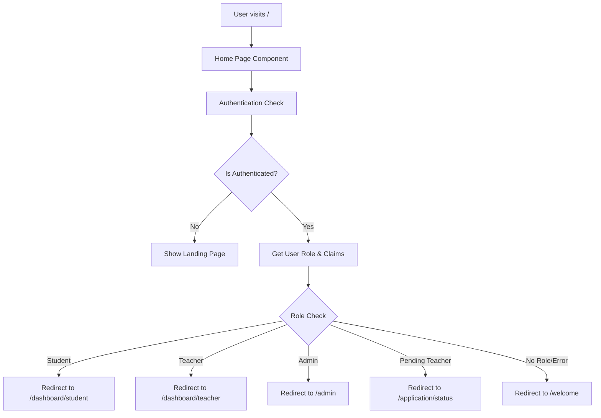

# Design Document

## Overview

The authenticated home redirect feature enhances the user experience by intelligently routing users based on their authentication state and role. This design implements a client-side authentication check on the home page that seamlessly redirects authenticated users to their appropriate dashboards while preserving the marketing landing page for unauthenticated visitors.

## Architecture

### High-Level Architecture



### Component Architecture

The design follows a layered approach:

1. **Presentation Layer**: Home page component with conditional rendering
2. **Authentication Layer**: Client-side auth state management
3. **Routing Layer**: Role-based redirect logic
4. **Utility Layer**: Existing auth utilities and helpers

## Components and Interfaces

### 1. Enhanced Home Page Component

**File**: `src/app/page.tsx`

The home page component will be enhanced with authentication-aware logic:

```typescript
interface HomePageProps {
  // No props needed - uses client-side auth
}

interface AuthRedirectState {
  isLoading: boolean;
  isAuthenticated: boolean;
  shouldRedirect: boolean;
  redirectPath: string | null;
}
```

**Key Features**:
- Client-side authentication check using `useClientAuth` hook
- Conditional rendering based on authentication state
- Smooth loading states during authentication verification
- Preservation of existing landing page functionality

### 2. Authentication Redirect Hook

**File**: `src/hooks/useAuthRedirect.ts`

A custom hook to handle authentication-based redirects:

```typescript
interface UseAuthRedirectOptions {
  enabled?: boolean;
  fallbackPath?: string;
  preserveQuery?: boolean;
}

interface UseAuthRedirectReturn {
  isRedirecting: boolean;
  shouldShowContent: boolean;
  redirectPath: string | null;
}

function useAuthRedirect(options?: UseAuthRedirectOptions): UseAuthRedirectReturn
```

**Responsibilities**:
- Monitor authentication state changes
- Calculate appropriate redirect path based on user role
- Handle loading states and error conditions
- Integrate with existing auth utilities

### 3. Enhanced Authentication Utilities

**File**: `src/lib/utils/auth-redirect.utils.ts` (existing file enhancement)

Add new utility functions:

```typescript
interface HomeRedirectOptions {
  user: User | null;
  claims: CustomClaims | null;
  isLoading: boolean;
}

function shouldRedirectFromHome(options: HomeRedirectOptions): boolean
function getHomeRedirectPath(options: HomeRedirectOptions): string | null
function handleHomePageAuth(router: NextRouter, options: HomeRedirectOptions): void
```

### 4. Loading Component

**File**: `src/components/ui/AuthLoadingSpinner.tsx`

A specialized loading component for authentication checks:

```typescript
interface AuthLoadingSpinnerProps {
  message?: string;
  showLogo?: boolean;
  className?: string;
}
```

## Data Models

### Authentication State Model

```typescript
interface AuthenticationState {
  user: User | null;
  claims: CustomClaims | null;
  isLoading: boolean;
  isAuthenticated: boolean;
  error: string | null;
}

interface RedirectDecision {
  shouldRedirect: boolean;
  path: string | null;
  reason: 'authenticated' | 'unauthenticated' | 'error' | 'incomplete_profile';
  preserveQuery: boolean;
}
```

### User Role Mapping

```typescript
const ROLE_DASHBOARD_MAP: Record<UserRole, string> = {
  [UserRole.STUDENT]: '/dashboard/student',
  [UserRole.TEACHER]: '/dashboard/teacher',
  [UserRole.ADMIN]: '/admin',
  [UserRole.PENDING_TEACHER]: '/application/status'
};
```

## Error Handling

### Authentication Errors

1. **Expired Tokens**: Clear session and show landing page
2. **Invalid Claims**: Redirect to welcome/onboarding
3. **Network Errors**: Show landing page with retry option
4. **Permission Errors**: Redirect to appropriate error page

### Error Recovery Strategies

```typescript
interface ErrorRecoveryStrategy {
  type: 'retry' | 'fallback' | 'redirect' | 'clear_session';
  maxRetries?: number;
  fallbackPath?: string;
  retryDelay?: number;
}

const ERROR_STRATEGIES: Record<string, ErrorRecoveryStrategy> = {
  'auth/network-request-failed': { type: 'retry', maxRetries: 3, retryDelay: 1000 },
  'auth/id-token-expired': { type: 'clear_session' },
  'auth/invalid-user-token': { type: 'clear_session' },
  'permission-denied': { type: 'redirect', fallbackPath: '/unauthorized' }
};
```

## Testing Strategy

### Unit Tests

1. **Authentication Hook Tests**
   - Test authentication state changes
   - Test redirect logic for each user role
   - Test error handling scenarios
   - Test loading state management

2. **Utility Function Tests**
   - Test role-to-dashboard mapping
   - Test redirect decision logic
   - Test query parameter preservation
   - Test error recovery strategies

3. **Component Tests**
   - Test conditional rendering based on auth state
   - Test loading states
   - Test error states
   - Test accessibility compliance

### Integration Tests

1. **Authentication Flow Tests**
   - Test complete authentication and redirect flow
   - Test unauthenticated user experience
   - Test role transitions
   - Test session expiration handling

2. **Navigation Tests**
   - Test redirect preservation of query parameters
   - Test browser back/forward behavior
   - Test deep linking scenarios
   - Test concurrent authentication state changes

### End-to-End Tests

1. **User Journey Tests**
   - Student login → dashboard redirect
   - Teacher login → dashboard redirect
   - Admin login → dashboard redirect
   - Unauthenticated visitor → landing page

2. **Edge Case Tests**
   - Expired session handling
   - Network connectivity issues
   - Concurrent tab authentication
   - Role permission changes

## Performance Considerations

### Optimization Strategies

1. **Authentication Check Optimization**
   - Use cached authentication state when available
   - Implement debounced authentication checks
   - Minimize Firebase API calls
   - Use local storage for session persistence

2. **Rendering Optimization**
   - Implement skeleton loading states
   - Use React.memo for landing page components
   - Lazy load dashboard components
   - Optimize bundle splitting for auth vs. public content

3. **Network Optimization**
   - Cache user role information
   - Implement offline-first authentication checks
   - Use service workers for auth state persistence
   - Minimize redirect chain length

### Performance Metrics

- **Authentication Check Time**: < 500ms
- **Redirect Time**: < 200ms
- **Landing Page Load Time**: < 2s
- **Dashboard Load Time**: < 3s

## Security Considerations

### Authentication Security

1. **Token Validation**
   - Always verify Firebase ID tokens server-side for sensitive operations
   - Implement token refresh logic
   - Handle token expiration gracefully
   - Clear invalid tokens immediately

2. **Role Verification**
   - Verify user roles against server-side claims
   - Implement role-based access control
   - Log authentication events for audit
   - Prevent role escalation attacks

3. **Session Management**
   - Implement secure session storage
   - Clear sensitive data on logout
   - Handle concurrent sessions appropriately
   - Implement session timeout policies

### Privacy Considerations

1. **Data Minimization**
   - Only store necessary user data in client state
   - Clear user data on authentication errors
   - Implement data retention policies
   - Respect user privacy preferences

2. **Audit Logging**
   - Log authentication events (success/failure)
   - Log redirect decisions for security analysis
   - Implement privacy-compliant logging
   - Enable security monitoring and alerting

## Implementation Phases

### Phase 1: Core Authentication Logic
- Implement `useAuthRedirect` hook
- Enhance existing auth utilities
- Add authentication state management
- Implement basic redirect logic

### Phase 2: Home Page Integration
- Modify home page component
- Add loading states and error handling
- Implement conditional rendering
- Add accessibility features

### Phase 3: Testing and Optimization
- Implement comprehensive test suite
- Add performance monitoring
- Optimize loading and redirect times
- Add error recovery mechanisms

### Phase 4: Security and Monitoring
- Implement audit logging
- Add security monitoring
- Perform security testing
- Add compliance features

## Migration Strategy

### Backward Compatibility

The implementation maintains full backward compatibility:

1. **Existing Users**: No changes to existing authentication flows
2. **API Compatibility**: No changes to existing API endpoints
3. **URL Structure**: All existing URLs remain functional
4. **Session Management**: Existing sessions continue to work

### Rollout Plan

1. **Development**: Implement and test in development environment
2. **Staging**: Deploy to staging for integration testing
3. **Canary**: Roll out to 10% of users for monitoring
4. **Full Deployment**: Complete rollout with monitoring

### Rollback Strategy

If issues arise, the system can be quickly rolled back by:

1. Reverting the home page component to show landing page only
2. Disabling the authentication redirect logic
3. Maintaining all existing authentication functionality
4. Preserving user sessions and data

This design ensures a smooth, secure, and performant implementation of authenticated home page redirects while maintaining the existing user experience for all user types.