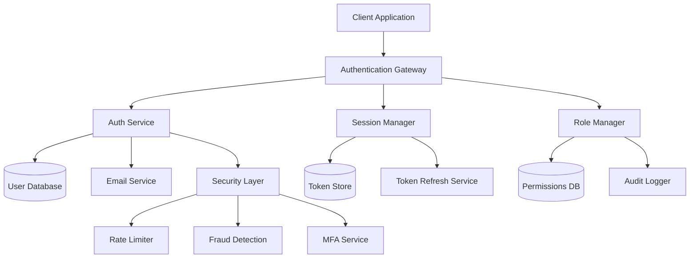

# Dedicated Authentication Flow - Design Document

## Overview

This design document outlines a comprehensive, security-focused authentication system for the Learnity platform that supports multiple user roles (Student, Teacher, Admin) with modern security practices, excellent user experience, and scalable architecture.

## Architecture

### High-Level System Architecture



### Technology Stack

```typescript
// Core Authentication Stack
const TECH_STACK = {
  backend: {
    framework: 'Next.js 14 API Routes',
    database: 'PostgreSQL with Prisma ORM',
    tokenManagement: 'JWT with RS256 signing',
    sessionStore: 'Redis for token blacklisting',
    emailService: 'Resend or SendGrid',
    encryption: 'bcrypt for passwords, crypto for tokens'
  },
  frontend: {
    framework: 'Next.js 14 with TypeScript',
    stateManagement: 'Zustand for auth state',
    formHandling: 'React Hook Form with Zod validation',
    uiComponents: 'Custom components with Tailwind CSS',
    biometrics: 'WebAuthn API for biometric auth'
  },
  security: {
    rateLimiting: 'Upstash Rate Limit',
    monitoring: 'Sentry for error tracking',
    logging: 'Winston for audit logs',
    mfa: 'speakeasy for TOTP generation'
  }
}
```

## Components and Interfaces

### 1. Authentication Service

```typescript
interface AuthService {
  // Registration methods
  registerStudent(data: StudentRegistrationData): Promise<AuthResult>
  registerTeacher(data: TeacherRegistrationData): Promise<AuthResult>
  registerAdmin(data: AdminRegistrationData, inviteCode: string): Promise<AuthResult>
  
  // Login methods
  login(credentials: LoginCredentials): Promise<AuthResult>
  loginWithMFA(credentials: LoginCredentials, mfaCode: string): Promise<AuthResult>
  socialLogin(provider: SocialProvider, token: string): Promise<AuthResult>
  
  // Account management
  verifyEmail(token: string): Promise<boolean>
  requestPasswordReset(email: string): Promise<boolean>
  resetPassword(token: string, newPassword: string): Promise<boolean>
  changePassword(userId: string, oldPassword: string, newPassword: string): Promise<boolean>
}

interface AuthResult {
  success: boolean
  user?: User
  tokens?: TokenPair
  requiresMFA?: boolean
  error?: AuthError
}

interface TokenPair {
  accessToken: string    // 15 minutes expiry
  refreshToken: string   // 7 days expiry
}
```

### 2. Session Manager

```typescript
interface SessionManager {
  // Token lifecycle
  generateTokens(user: User): Promise<TokenPair>
  refreshTokens(refreshToken: string): Promise<TokenPair>
  revokeTokens(userId: string): Promise<void>
  revokeAllUserTokens(userId: string): Promise<void>
  
  // Session validation
  validateAccessToken(token: string): Promise<TokenPayload | null>
  isTokenBlacklisted(tokenId: string): Promise<boolean>
  blacklistToken(tokenId: string, expiresAt: Date): Promise<void>
  
  // Session monitoring
  getActiveSessions(userId: string): Promise<Session[]>
  terminateSession(sessionId: string): Promise<void>
}

interface TokenPayload {
  userId: string
  email: string
  role: UserRole
  permissions: string[]
  sessionId: string
  iat: number
  exp: number
  jti: string  // JWT ID for blacklisting
}

interface Session {
  id: string
  userId: string
  deviceInfo: DeviceInfo
  ipAddress: string
  lastActivity: Date
  createdAt: Date
}
```

### 3. Role Manager

```typescript
interface RoleManager {
  // Permission checking
  hasPermission(userId: string, permission: string): Promise<boolean>
  hasRole(userId: string, role: UserRole): Promise<boolean>
  getUserPermissions(userId: string): Promise<string[]>
  
  // Role management
  assignRole(userId: string, role: UserRole): Promise<void>
  removeRole(userId: string, role: UserRole): Promise<void>
  updateUserPermissions(userId: string, permissions: string[]): Promise<void>
  
  // Teacher approval workflow
  submitTeacherApplication(userId: string, application: TeacherApplication): Promise<void>
  reviewTeacherApplication(applicationId: string, decision: ApprovalDecision): Promise<void>
  getTeacherApplications(status?: ApplicationStatus): Promise<TeacherApplication[]>
}

enum UserRole {
  STUDENT = 'student',
  TEACHER = 'teacher',
  ADMIN = 'admin',
  PENDING_TEACHER = 'pending_teacher'
}

enum Permission {
  // Student permissions
  VIEW_STUDENT_DASHBOARD = 'view:student_dashboard',
  JOIN_STUDY_GROUPS = 'join:study_groups',
  BOOK_TUTORING = 'book:tutoring',
  
  // Teacher permissions
  VIEW_TEACHER_DASHBOARD = 'view:teacher_dashboard',
  MANAGE_SESSIONS = 'manage:sessions',
  UPLOAD_CONTENT = 'upload:content',
  VIEW_STUDENT_PROGRESS = 'view:student_progress',
  
  // Admin permissions
  VIEW_ADMIN_PANEL = 'view:admin_panel',
  MANAGE_USERS = 'manage:users',
  APPROVE_TEACHERS = 'approve:teachers',
  VIEW_AUDIT_LOGS = 'view:audit_logs'
}
```

### 4. Security Layer

```typescript
interface SecurityLayer {
  // Rate limiting
  checkRateLimit(identifier: string, action: string): Promise<RateLimitResult>
  incrementRateLimit(identifier: string, action: string): Promise<void>
  
  // Fraud detection
  analyzeLoginAttempt(attempt: LoginAttempt): Promise<SecurityAssessment>
  flagSuspiciousActivity(userId: string, activity: SecurityEvent): Promise<void>
  
  // MFA management
  generateMFASecret(userId: string): Promise<MFASetup>
  verifyMFACode(userId: string, code: string): Promise<boolean>
  generateBackupCodes(userId: string): Promise<string[]>
  
  // Device management
  registerDevice(userId: string, deviceInfo: DeviceInfo): Promise<string>
  isKnownDevice(userId: string, deviceFingerprint: string): Promise<boolean>
  sendSecurityNotification(userId: string, event: SecurityEvent): Promise<void>
}

interface RateLimitResult {
  allowed: boolean
  remaining: number
  resetTime: Date
  retryAfter?: number
}

interface SecurityAssessment {
  riskLevel: 'low' | 'medium' | 'high'
  requiresAdditionalVerification: boolean
  blockedReasons: string[]
  recommendations: string[]
}
```

## Data Models

### User Data Model

```typescript
interface User {
  id: string
  email: string
  emailVerified: boolean
  passwordHash: string
  role: UserRole
  profile: UserProfile
  
  // Security fields
  mfaEnabled: boolean
  mfaSecret?: string
  backupCodes?: string[]
  lastLogin?: Date
  failedLoginAttempts: number
  lockedUntil?: Date
  
  // Audit fields
  createdAt: Date
  updatedAt: Date
  lastPasswordChange: Date
}

interface UserProfile {
  firstName: string
  lastName: string
  avatar?: string
  
  // Role-specific fields
  studentProfile?: StudentProfile
  teacherProfile?: TeacherProfile
  adminProfile?: AdminProfile
}

interface StudentProfile {
  gradeLevel: string
  subjects: string[]
  learningGoals: string[]
}

interface TeacherProfile {
  qualifications: string[]
  subjects: string[]
  experience: number
  hourlyRate?: number
  bio?: string
  applicationStatus: ApplicationStatus
  approvedAt?: Date
  approvedBy?: string
}

interface AdminProfile {
  department: string
  permissions: string[]
  invitedBy: string
}
```

### Authentication Events Model

```typescript
interface AuthEvent {
  id: string
  userId: string
  type: AuthEventType
  success: boolean
  ipAddress: string
  userAgent: string
  deviceFingerprint: string
  metadata: Record<string, any>
  createdAt: Date
}

enum AuthEventType {
  LOGIN = 'login',
  LOGOUT = 'logout',
  REGISTER = 'register',
  PASSWORD_CHANGE = 'password_change',
  PASSWORD_RESET = 'password_reset',
  EMAIL_VERIFY = 'email_verify',
  MFA_ENABLE = 'mfa_enable',
  MFA_DISABLE = 'mfa_disable',
  ROLE_CHANGE = 'role_change',
  ACCOUNT_LOCK = 'account_lock',
  SUSPICIOUS_ACTIVITY = 'suspicious_activity'
}
```

## Error Handling

### Authentication Error Types

```typescript
enum AuthErrorCode {
  // Credential errors
  INVALID_CREDENTIALS = 'INVALID_CREDENTIALS',
  ACCOUNT_NOT_FOUND = 'ACCOUNT_NOT_FOUND',
  EMAIL_NOT_VERIFIED = 'EMAIL_NOT_VERIFIED',
  ACCOUNT_LOCKED = 'ACCOUNT_LOCKED',
  
  // Password errors
  WEAK_PASSWORD = 'WEAK_PASSWORD',
  PASSWORD_REUSED = 'PASSWORD_REUSED',
  INVALID_RESET_TOKEN = 'INVALID_RESET_TOKEN',
  
  // Rate limiting
  TOO_MANY_ATTEMPTS = 'TOO_MANY_ATTEMPTS',
  RATE_LIMIT_EXCEEDED = 'RATE_LIMIT_EXCEEDED',
  
  // MFA errors
  INVALID_MFA_CODE = 'INVALID_MFA_CODE',
  MFA_REQUIRED = 'MFA_REQUIRED',
  MFA_SETUP_REQUIRED = 'MFA_SETUP_REQUIRED',
  
  // Role/Permission errors
  INSUFFICIENT_PERMISSIONS = 'INSUFFICIENT_PERMISSIONS',
  ROLE_NOT_APPROVED = 'ROLE_NOT_APPROVED',
  INVALID_INVITE_CODE = 'INVALID_INVITE_CODE',
  
  // Token errors
  TOKEN_EXPIRED = 'TOKEN_EXPIRED',
  TOKEN_INVALID = 'TOKEN_INVALID',
  TOKEN_REVOKED = 'TOKEN_REVOKED',
  
  // System errors
  SERVICE_UNAVAILABLE = 'SERVICE_UNAVAILABLE',
  INTERNAL_ERROR = 'INTERNAL_ERROR'
}

interface AuthError {
  code: AuthErrorCode
  message: string
  details?: Record<string, any>
  retryAfter?: number
}
```

### Error Response Strategy

```typescript
const ERROR_RESPONSES = {
  // User-friendly messages
  [AuthErrorCode.INVALID_CREDENTIALS]: {
    message: "Invalid email or password. Please try again.",
    action: "retry"
  },
  [AuthErrorCode.TOO_MANY_ATTEMPTS]: {
    message: "Too many failed attempts. Please try again in {retryAfter} minutes.",
    action: "wait"
  },
  [AuthErrorCode.EMAIL_NOT_VERIFIED]: {
    message: "Please verify your email address before signing in.",
    action: "verify_email"
  },
  [AuthErrorCode.MFA_REQUIRED]: {
    message: "Please enter your authentication code.",
    action: "provide_mfa"
  }
}
```

## Testing Strategy

### Unit Testing

```typescript
// Authentication service tests
describe('AuthService', () => {
  describe('registerStudent', () => {
    it('should create student account with valid data')
    it('should reject weak passwords')
    it('should prevent duplicate email registration')
    it('should send verification email')
  })
  
  describe('login', () => {
    it('should authenticate valid credentials')
    it('should reject invalid credentials')
    it('should enforce rate limiting')
    it('should require MFA when enabled')
  })
})

// Role manager tests
describe('RoleManager', () => {
  describe('hasPermission', () => {
    it('should grant student permissions to students')
    it('should deny teacher permissions to students')
    it('should grant admin permissions to admins')
  })
})
```

### Integration Testing

```typescript
// End-to-end authentication flows
describe('Authentication Flows', () => {
  it('should complete student registration flow')
  it('should complete teacher application and approval flow')
  it('should handle password reset flow')
  it('should enforce MFA setup for admins')
  it('should handle social login integration')
})
```

### Security Testing

```typescript
// Security test scenarios
describe('Security Tests', () => {
  it('should prevent brute force attacks')
  it('should detect and block suspicious login patterns')
  it('should properly invalidate tokens on logout')
  it('should enforce password complexity requirements')
  it('should protect against timing attacks')
})
```

## Performance Considerations

### Caching Strategy

```typescript
const CACHE_STRATEGY = {
  userPermissions: {
    ttl: 300, // 5 minutes
    strategy: 'write-through'
  },
  rateLimitCounters: {
    ttl: 3600, // 1 hour
    strategy: 'write-behind'
  },
  tokenBlacklist: {
    ttl: 'token_expiry',
    strategy: 'write-through'
  }
}
```

### Database Optimization

```sql
-- Optimized indexes for auth queries
CREATE INDEX idx_users_email ON users(email);
CREATE INDEX idx_users_role ON users(role);
CREATE INDEX idx_auth_events_user_type ON auth_events(user_id, type);
CREATE INDEX idx_sessions_user_active ON sessions(user_id, last_activity);
```

### Monitoring and Metrics

```typescript
const AUTH_METRICS = {
  // Performance metrics
  loginLatency: 'histogram',
  tokenGenerationTime: 'histogram',
  permissionCheckTime: 'histogram',
  
  // Business metrics
  registrationRate: 'counter',
  loginSuccessRate: 'gauge',
  mfaAdoptionRate: 'gauge',
  
  // Security metrics
  failedLoginAttempts: 'counter',
  suspiciousActivityDetected: 'counter',
  accountLockouts: 'counter'
}
```

This design provides a comprehensive, secure, and scalable authentication system that can handle all user roles while maintaining excellent user experience and strong security practices.