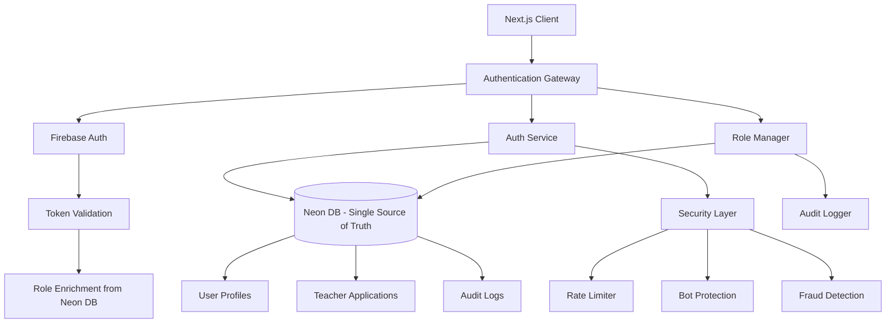

# Dedicated Authentication Flow - Design Document

## Overview

This design document outlines a comprehensive authentication system for the Learnity platform that integrates Firebase Auth for authentication with Neon DB as the single source of truth for user data. The system supports multiple user roles (Student, Teacher, Admin) with advanced security features, bot protection, and fault tolerance.

## Architecture

### High-Level System Architecture



### Technology Stack

```typescript
// Firebase + Neon DB Authentication Stack
const TECH_STACK = {
  authentication: {
    provider: 'Firebase Auth v10+',
    methods: ['Email/Password', 'Google OAuth', 'Microsoft OAuth'],
    tokenManagement: 'Firebase Auth ID Tokens + Custom Claims',
    emailVerification: 'Firebase Auth Email Verification',
    rateLimiting: 'Firebase Auth built-in rate limiting',
    appCheck: 'Firebase App Check for bot protection'
  },
  backend: {
    framework: 'Next.js 15 API Routes (App Router)',
    database: 'Neon DB (PostgreSQL) with Prisma ORM',
    validation: 'Zod schemas for all inputs',
    fileStorage: 'Firebase Storage for documents/avatars',
    caching: 'Next.js 15 built-in caching + In-memory rate limiting'
  },
  frontend: {
    framework: 'Next.js 15 with TypeScript (strict mode)',
    stateManagement: 'Zustand for auth state',
    formHandling: 'React Hook Form with Zod validation',
    uiComponents: 'shadcn/ui with Tailwind CSS',
    styling: 'Tailwind CSS with mobile-first approach'
  },
  security: {
    rateLimiting: 'Firebase Auth built-in rate limiting + App Check',
    botProtection: 'Firebase App Check + reCAPTCHA Enterprise',
    monitoring: 'Custom audit logging to Neon DB',
    encryption: 'Firebase Auth security + HTTPS only'
  }
} as const;
```

## Components and Interfaces

### 1. Firebase Auth Integration Service

```typescript
interface IFirebaseAuthService {
  // Registration methods
  registerStudent(data: StudentRegistrationData): Promise<FirebaseAuthResult>
  registerTeacher(data: TeacherRegistrationData): Promise<FirebaseAuthResult>
  loginStaticAdmin(credentials: StaticAdminCredentials): Promise<FirebaseAuthResult>
  
  // Login methods
  login(credentials: LoginCredentials): Promise<FirebaseAuthResult>
  socialLogin(provider: 'google' | 'microsoft'): Promise<FirebaseAuthResult>
  
  // Account management
  sendEmailVerification(user: FirebaseUser): Promise<void>
  sendPasswordReset(email: string): Promise<void>
  updatePassword(newPassword: string): Promise<void>
  
  // Token management
  getCurrentUser(): Promise<FirebaseUser | null>
  getIdToken(forceRefresh?: boolean): Promise<string>
  signOut(): Promise<void>
}

interface FirebaseAuthResult {
  success: boolean
  user?: FirebaseUser
  idToken?: string
  needsEmailVerification?: boolean
  error?: AuthError
}

interface FirebaseUser {
  uid: string
  email: string
  emailVerified: boolean
  displayName?: string
  photoURL?: string
}
```

### 2. User Profile Service (Neon DB Integration)

```typescript
interface IUserProfileService {
  // Profile management
  createUserProfile(firebaseUid: string, data: CreateProfileData): Promise<UserProfile>
  getUserProfile(firebaseUid: string): Promise<UserProfile | null>
  updateUserProfile(firebaseUid: string, data: UpdateProfileData): Promise<UserProfile>
  
  // Role management
  getUserRole(firebaseUid: string): Promise<UserRole>
  updateUserRole(firebaseUid: string, role: UserRole): Promise<void>
  
  // Teacher application workflow
  submitTeacherApplication(firebaseUid: string, application: TeacherApplicationData): Promise<void>
  getTeacherApplications(status?: ApplicationStatus): Promise<TeacherApplication[]>
  reviewTeacherApplication(applicationId: string, decision: ApprovalDecision): Promise<void>
  
  // Student profile enhancement
  enhanceStudentProfile(firebaseUid: string, enhancements: StudentEnhancements): Promise<void>
  getProfileCompletionStatus(firebaseUid: string): Promise<ProfileCompletion>
}

interface UserProfile {
  id: string
  firebaseUid: string
  email: string
  firstName: string
  lastName: string
  role: UserRole
  emailVerified: boolean
  profilePicture?: string
  createdAt: Date
  updatedAt: Date
  lastLoginAt?: Date
  
  // Role-specific data
  studentProfile?: StudentProfile
  teacherProfile?: TeacherProfile
  adminProfile?: AdminProfile
}

interface StudentProfile {
  gradeLevel: string
  subjects: string[]
  learningGoals?: string[]
  interests?: string[]
  studyPreferences?: string[]
  profileCompletionPercentage: number
}

interface TeacherProfile {
  applicationStatus: 'PENDING' | 'APPROVED' | 'REJECTED'
  qualifications: string[]
  subjects: string[]
  experience: number
  bio?: string
  hourlyRate?: number
  documents: string[] // Firebase Storage URLs
  approvedAt?: Date
  approvedBy?: string
  rejectionReason?: string
}
```

### 3. Role & Permission Manager

```typescript
interface IRoleManager {
  // Permission checking
  hasPermission(firebaseUid: string, permission: Permission): Promise<boolean>
  hasRole(firebaseUid: string, role: UserRole): Promise<boolean>
  getUserPermissions(firebaseUid: string): Promise<Permission[]>
  
  // Firebase custom claims management
  setCustomClaims(firebaseUid: string, claims: CustomClaims): Promise<void>
  getCustomClaims(firebaseUid: string): Promise<CustomClaims>
  
  // Route protection
  validateRouteAccess(firebaseUid: string, route: string): Promise<boolean>
  requireRole(requiredRole: UserRole): (firebaseUid: string) => Promise<boolean>
}

enum UserRole {
  STUDENT = 'STUDENT',
  TEACHER = 'TEACHER',
  ADMIN = 'ADMIN',
  PENDING_TEACHER = 'PENDING_TEACHER'
}

enum Permission {
  // Student permissions
  VIEW_STUDENT_DASHBOARD = 'view:student_dashboard',
  JOIN_STUDY_GROUPS = 'join:study_groups',
  BOOK_TUTORING = 'book:tutoring',
  ENHANCE_PROFILE = 'enhance:profile',
  
  // Teacher permissions
  VIEW_TEACHER_DASHBOARD = 'view:teacher_dashboard',
  MANAGE_SESSIONS = 'manage:sessions',
  UPLOAD_CONTENT = 'upload:content',
  VIEW_STUDENT_PROGRESS = 'view:student_progress',
  
  // Pending teacher permissions
  VIEW_APPLICATION_STATUS = 'view:application_status',
  UPDATE_APPLICATION = 'update:application',
  
  // Admin permissions
  VIEW_ADMIN_PANEL = 'view:admin_panel',
  MANAGE_USERS = 'manage:users',
  APPROVE_TEACHERS = 'approve:teachers',
  VIEW_AUDIT_LOGS = 'view:audit_logs',
  MANAGE_PLATFORM = 'manage:platform'
}

interface CustomClaims {
  role: UserRole
  permissions: Permission[]
  profileComplete: boolean
  emailVerified: boolean
}
```

### 4. Security & Bot Protection Layer

```typescript
interface ISecurityService {
  // Firebase App Check integration
  verifyAppCheckToken(token: string): Promise<boolean>
  generateAppCheckToken(): Promise<string>
  
  // Firebase reCAPTCHA Enterprise
  verifyRecaptcha(token: string, action: string): Promise<RecaptchaResult>
  
  // Device and request analysis
  analyzeRequest(request: SecurityRequest): Promise<SecurityAssessment>
  generateDeviceFingerprint(request: Request): string
  
  // Fraud detection
  analyzeLoginAttempt(attempt: LoginAttempt): Promise<SecurityAssessment>
  flagSuspiciousActivity(firebaseUid: string, activity: SecurityEvent): Promise<void>
  
  // Audit logging
  logAuthEvent(event: AuthEvent): Promise<void>
  logSecurityEvent(event: SecurityEvent): Promise<void>
  getAuditLogs(filters: AuditFilters): Promise<AuditLog[]>
}

interface RecaptchaResult {
  success: boolean
  score: number // 0.0 to 1.0, higher is more likely human
  action: string
  challenge_ts: string
}

interface SecurityAssessment {
  riskLevel: 'LOW' | 'MEDIUM' | 'HIGH'
  requiresAdditionalVerification: boolean
  requiresCaptcha: boolean
  blockedReasons: string[]
  allowedActions: SecurityAction[]
}

enum SecurityAction {
  LOGIN = 'LOGIN',
  REGISTER = 'REGISTER',
  PASSWORD_RESET = 'PASSWORD_RESET',
  PROFILE_UPDATE = 'PROFILE_UPDATE',
  TEACHER_APPLICATION = 'TEACHER_APPLICATION'
}

interface SecurityRequest {
  ipAddress: string
  userAgent: string
  deviceFingerprint: string
  timestamp: Date
  action: SecurityAction
  firebaseUid?: string
}
```

## Data Models

### Neon DB Schema (Prisma)

```prisma
// User profile stored in Neon DB (single source of truth)
model User {
  id                String    @id @default(cuid())
  firebaseUid       String    @unique // Links to Firebase Auth user
  email             String    @unique
  firstName         String
  lastName          String
  role              UserRole
  emailVerified     Boolean   @default(false)
  profilePicture    String?   // Firebase Storage URL
  isActive          Boolean   @default(true)
  lastLoginAt       DateTime?
  createdAt         DateTime  @default(now())
  updatedAt         DateTime  @updatedAt
  
  // Relations
  studentProfile    StudentProfile?
  teacherProfile    TeacherProfile?
  adminProfile      AdminProfile?
  auditLogs         AuditLog[]
  securityEvents    SecurityEvent[]
  
  @@map("users")
}

model StudentProfile {
  id                          String   @id @default(cuid())
  userId                      String   @unique
  gradeLevel                  String
  subjects                    String[] // Array of subject interests
  learningGoals               String[] // Optional enhancements
  interests                   String[] // Optional enhancements
  studyPreferences            String[] // Optional enhancements
  profileCompletionPercentage Int      @default(20) // Basic info = 20%
  
  user User @relation(fields: [userId], references: [id], onDelete: Cascade)
  
  @@map("student_profiles")
}

model TeacherProfile {
  id                String              @id @default(cuid())
  userId            String              @unique
  applicationStatus ApplicationStatus   @default(PENDING)
  qualifications    String[]
  subjects          String[]
  experience        Int                 // Years of experience
  bio               String?
  hourlyRate        Decimal?
  documents         String[]            // Firebase Storage URLs
  submittedAt       DateTime            @default(now())
  reviewedAt        DateTime?
  approvedBy        String?             // Admin user ID
  rejectionReason   String?
  
  user User @relation(fields: [userId], references: [id], onDelete: Cascade)
  
  @@map("teacher_profiles")
}

model AdminProfile {
  id          String   @id @default(cuid())
  userId      String   @unique
  department  String   @default("Platform Management")
  isStatic    Boolean  @default(false) // True for env-configured admin
  createdBy   String?  // Who created this admin
  
  user User @relation(fields: [userId], references: [id], onDelete: Cascade)
  
  @@map("admin_profiles")
}

enum UserRole {
  STUDENT
  TEACHER
  ADMIN
  PENDING_TEACHER
}

enum ApplicationStatus {
  PENDING
  APPROVED
  REJECTED
}
```

### Audit & Security Models

```prisma
model AuditLog {
  id              String    @id @default(cuid())
  userId          String?   // Nullable for system events
  firebaseUid     String?
  eventType       EventType
  action          String
  resource        String?
  oldValues       Json?
  newValues       Json?
  ipAddress       String
  userAgent       String
  deviceFingerprint String?
  success         Boolean
  errorMessage    String?
  metadata        Json?
  createdAt       DateTime  @default(now())
  
  user User? @relation(fields: [userId], references: [id])
  
  @@map("audit_logs")
}

model SecurityEvent {
  id                String        @id @default(cuid())
  userId            String?
  firebaseUid       String?
  eventType         SecurityEventType
  riskLevel         RiskLevel
  ipAddress         String
  userAgent         String
  deviceFingerprint String
  blocked           Boolean       @default(false)
  reason            String?
  metadata          Json?
  createdAt         DateTime      @default(now())
  
  user User? @relation(fields: [userId], references: [id])
  
  @@map("security_events")
}

enum EventType {
  AUTH_LOGIN
  AUTH_LOGOUT
  AUTH_REGISTER
  AUTH_PASSWORD_RESET
  AUTH_EMAIL_VERIFY
  PROFILE_UPDATE
  ROLE_CHANGE
  TEACHER_APPLICATION_SUBMIT
  TEACHER_APPLICATION_APPROVE
  TEACHER_APPLICATION_REJECT
  ADMIN_ACTION
}

enum SecurityEventType {
  SUSPICIOUS_LOGIN
  RATE_LIMIT_EXCEEDED
  BOT_DETECTED
  MULTIPLE_FAILED_ATTEMPTS
  NEW_DEVICE_LOGIN
  UNUSUAL_ACTIVITY
}

enum RiskLevel {
  LOW
  MEDIUM
  HIGH
  CRITICAL
}
```

## Firebase + Neon DB Integration Strategy

### Authentication Flow

```typescript
// 1. User Registration Flow
const registrationFlow = {
  step1: 'Create Firebase Auth account',
  step2: 'Send email verification via Firebase',
  step3: 'Create user profile in Neon DB with firebaseUid',
  step4: 'Set Firebase custom claims based on role',
  step5: 'Redirect to appropriate dashboard'
}

// 2. Login Flow
const loginFlow = {
  step1: 'Authenticate with Firebase Auth',
  step2: 'Get Firebase ID token',
  step3: 'Fetch user profile from Neon DB using firebaseUid',
  step4: 'Enrich token with custom claims from Neon DB',
  step5: 'Store auth state in Zustand',
  step6: 'Redirect based on role and profile completion'
}

// 3. Static Admin Flow
const staticAdminFlow = {
  step1: 'Validate credentials against environment variables',
  step2: 'Create/update Firebase Auth account for admin',
  step3: 'Create/update admin profile in Neon DB',
  step4: 'Set ADMIN role in Firebase custom claims',
  step5: 'Grant full platform access'
}
```

### Data Synchronization Strategy

```typescript
interface ISyncService {
  // Sync Firebase user changes to Neon DB
  syncFirebaseUserToNeonDB(firebaseUser: FirebaseUser): Promise<void>
  
  // Update Firebase custom claims from Neon DB data
  syncNeonDBToFirebaseClaims(firebaseUid: string): Promise<void>
  
  // Handle email verification sync
  handleEmailVerificationSync(firebaseUid: string): Promise<void>
  
  // Batch sync for data consistency
  performConsistencyCheck(): Promise<SyncReport>
}

// Automatic sync triggers
const syncTriggers = {
  onUserProfileUpdate: 'Update Firebase custom claims',
  onRoleChange: 'Update Firebase custom claims immediately',
  onEmailVerification: 'Sync verification status to Neon DB',
  onTeacherApproval: 'Update role in both Firebase and Neon DB',
  dailyConsistencyCheck: 'Ensure data consistency between systems'
}
```

### Fault Tolerance Implementation

```typescript
interface IFaultToleranceService {
  // Graceful degradation strategies
  handleFirebaseDowntime(): Promise<DegradedAuthState>
  handleNeonDBDowntime(): Promise<CachedAuthState>
  
  // Retry mechanisms
  retryWithExponentialBackoff<T>(operation: () => Promise<T>): Promise<T>
  
  // Circuit breaker pattern
  executeWithCircuitBreaker<T>(operation: () => Promise<T>): Promise<T>
  
  // Data recovery
  recoverFromPartialFailure(failureType: FailureType): Promise<RecoveryResult>
}

const faultToleranceStrategies = {
  firebaseDown: {
    strategy: 'Use cached user data from Neon DB',
    limitations: 'No new registrations, limited token refresh',
    recovery: 'Auto-sync when Firebase comes back online',
    rateLimiting: 'Firebase handles this automatically'
  },
  neonDBDown: {
    strategy: 'Use Firebase Auth for basic authentication',
    limitations: 'No profile updates, limited role checking',
    recovery: 'Queue operations and replay when DB is available'
  },
  rateLimitHit: {
    strategy: 'Firebase Auth automatically handles rate limiting',
    response: 'Show user-friendly message with retry timing',
    escalation: 'Firebase App Check for additional verification'
  },
  networkIssues: {
    strategy: 'Exponential backoff with jitter',
    maxRetries: 3,
    fallback: 'Show user-friendly error with retry option'
  }
}
```

## Error Handling

### Authentication Error Types

```typescript
enum AuthErrorCode {
  // Credential errors
  INVALID_CREDENTIALS = 'INVALID_CREDENTIALS',
  ACCOUNT_NOT_FOUND = 'ACCOUNT_NOT_FOUND',
  EMAIL_NOT_VERIFIED = 'EMAIL_NOT_VERIFIED',
  ACCOUNT_LOCKED = 'ACCOUNT_LOCKED',
  
  // Password errors
  WEAK_PASSWORD = 'WEAK_PASSWORD',
  PASSWORD_REUSED = 'PASSWORD_REUSED',
  INVALID_RESET_TOKEN = 'INVALID_RESET_TOKEN',
  
  // Rate limiting
  TOO_MANY_ATTEMPTS = 'TOO_MANY_ATTEMPTS',
  RATE_LIMIT_EXCEEDED = 'RATE_LIMIT_EXCEEDED',
  
  // MFA errors
  INVALID_MFA_CODE = 'INVALID_MFA_CODE',
  MFA_REQUIRED = 'MFA_REQUIRED',
  MFA_SETUP_REQUIRED = 'MFA_SETUP_REQUIRED',
  
  // Role/Permission errors
  INSUFFICIENT_PERMISSIONS = 'INSUFFICIENT_PERMISSIONS',
  ROLE_NOT_APPROVED = 'ROLE_NOT_APPROVED',
  INVALID_INVITE_CODE = 'INVALID_INVITE_CODE',
  
  // Token errors
  TOKEN_EXPIRED = 'TOKEN_EXPIRED',
  TOKEN_INVALID = 'TOKEN_INVALID',
  TOKEN_REVOKED = 'TOKEN_REVOKED',
  
  // System errors
  SERVICE_UNAVAILABLE = 'SERVICE_UNAVAILABLE',
  INTERNAL_ERROR = 'INTERNAL_ERROR'
}

interface AuthError {
  code: AuthErrorCode
  message: string
  details?: Record<string, any>
  retryAfter?: number
}
```

### Error Response Strategy

```typescript
const ERROR_RESPONSES = {
  // User-friendly messages
  [AuthErrorCode.INVALID_CREDENTIALS]: {
    message: "Invalid email or password. Please try again.",
    action: "retry"
  },
  [AuthErrorCode.TOO_MANY_ATTEMPTS]: {
    message: "Too many failed attempts. Please try again in {retryAfter} minutes.",
    action: "wait"
  },
  [AuthErrorCode.EMAIL_NOT_VERIFIED]: {
    message: "Please verify your email address before signing in.",
    action: "verify_email"
  },
  [AuthErrorCode.MFA_REQUIRED]: {
    message: "Please enter your authentication code.",
    action: "provide_mfa"
  }
}
```

## Testing Strategy

### Unit Testing

```typescript
// Authentication service tests
describe('AuthService', () => {
  describe('registerStudent', () => {
    it('should create student account with valid data')
    it('should reject weak passwords')
    it('should prevent duplicate email registration')
    it('should send verification email')
  })
  
  describe('login', () => {
    it('should authenticate valid credentials')
    it('should reject invalid credentials')
    it('should enforce rate limiting')
    it('should require MFA when enabled')
  })
})

// Role manager tests
describe('RoleManager', () => {
  describe('hasPermission', () => {
    it('should grant student permissions to students')
    it('should deny teacher permissions to students')
    it('should grant admin permissions to admins')
  })
})
```

### Integration Testing

```typescript
// End-to-end authentication flows
describe('Authentication Flows', () => {
  it('should complete student registration flow')
  it('should complete teacher application and approval flow')
  it('should handle password reset flow')
  it('should enforce MFA setup for admins')
  it('should handle social login integration')
})
```

### Security Testing

```typescript
// Security test scenarios
describe('Security Tests', () => {
  it('should prevent brute force attacks')
  it('should detect and block suspicious login patterns')
  it('should properly invalidate tokens on logout')
  it('should enforce password complexity requirements')
  it('should protect against timing attacks')
})
```

## Performance Considerations

### Caching Strategy

```typescript
const CACHE_STRATEGY = {
  userPermissions: {
    ttl: 300, // 5 minutes
    strategy: 'write-through'
  },
  rateLimitCounters: {
    ttl: 3600, // 1 hour
    strategy: 'write-behind'
  },
  tokenBlacklist: {
    ttl: 'token_expiry',
    strategy: 'write-through'
  }
}
```

### Database Optimization

```sql
-- Optimized indexes for auth queries
CREATE INDEX idx_users_email ON users(email);
CREATE INDEX idx_users_role ON users(role);
CREATE INDEX idx_auth_events_user_type ON auth_events(user_id, type);
CREATE INDEX idx_sessions_user_active ON sessions(user_id, last_activity);
```

### Monitoring and Metrics

```typescript
const AUTH_METRICS = {
  // Performance metrics
  loginLatency: 'histogram',
  tokenGenerationTime: 'histogram',
  permissionCheckTime: 'histogram',
  
  // Business metrics
  registrationRate: 'counter',
  loginSuccessRate: 'gauge',
  mfaAdoptionRate: 'gauge',
  
  // Security metrics
  failedLoginAttempts: 'counter',
  suspiciousActivityDetected: 'counter',
  accountLockouts: 'counter'
}
```

This design provides a comprehensive, secure, and scalable authentication system that can handle all user roles while maintaining excellent user experience and strong security practices.