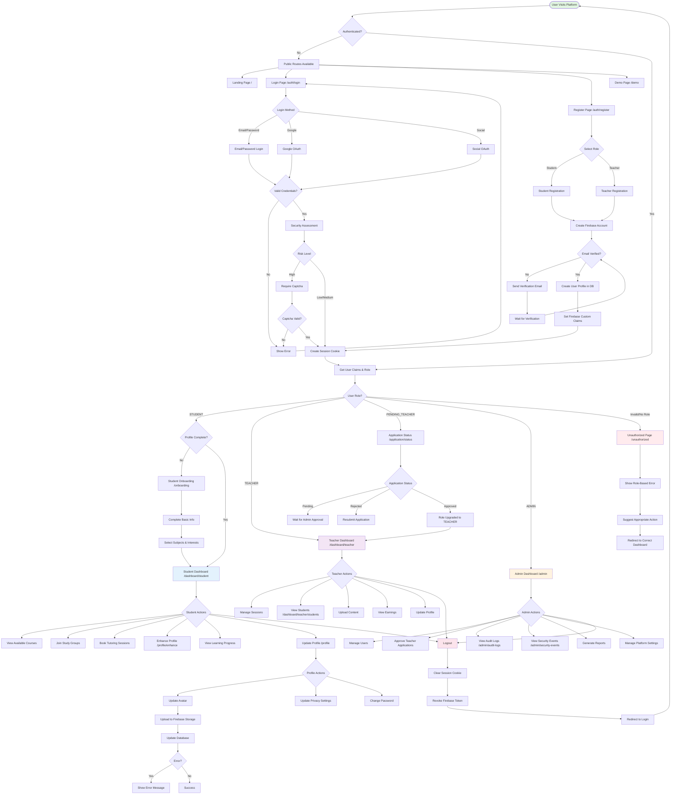
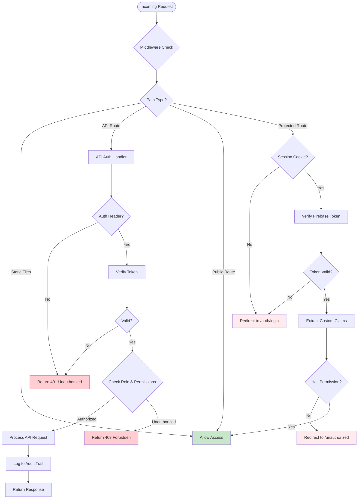
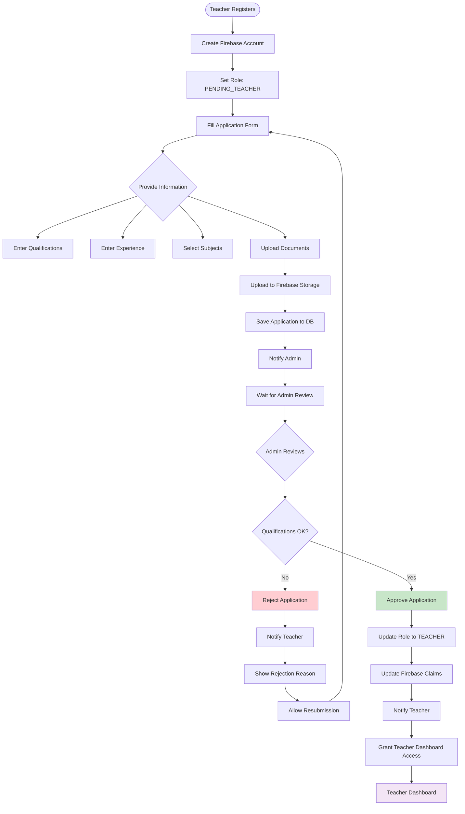
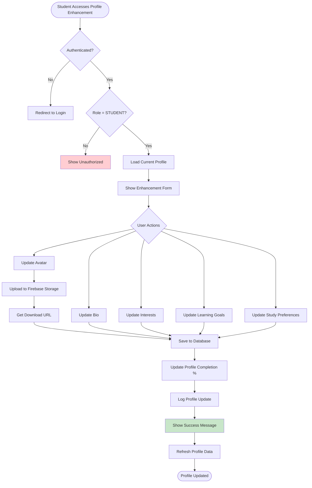
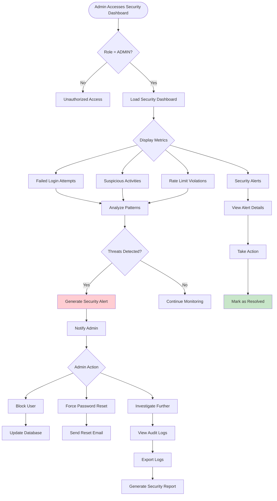
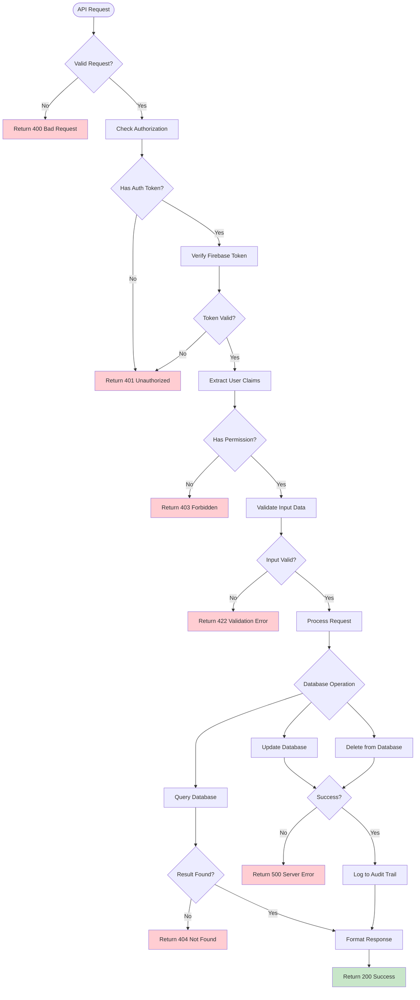
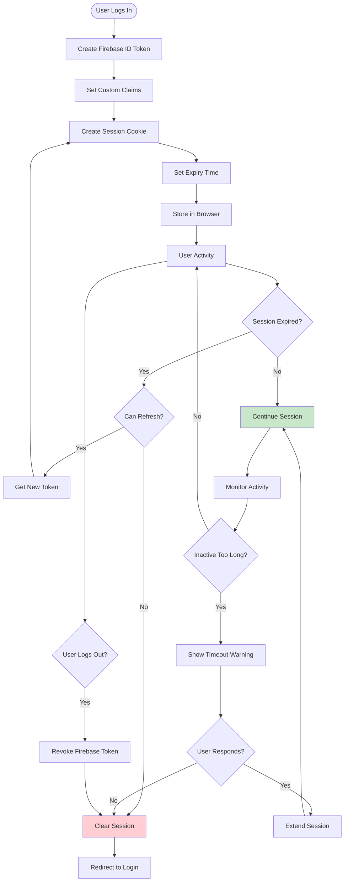
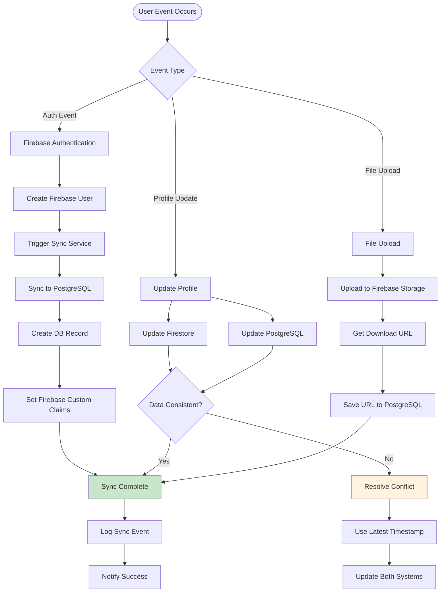

# Learnity Platform - Complete Activity Diagram Flow

## Overview
This document provides a comprehensive activity diagram showing all user flows, authentication processes, and system interactions in the Learnity platform.

---

## 1. Main User Flow Diagram

---

## 2. Authentication & Authorization Flow

---

## 3. Teacher Application Flow

---

## 4. Profile Enhancement Flow (Student)

---

## 5. Admin Security Monitoring Flow

---

## 6. API Request Flow

---

## 7. Session Management Flow

---

## 8. Data Synchronization Flow (Firebase + PostgreSQL)

---

## Key Components Summary

### 1. **Authentication System**
- Firebase Authentication (Email/Password, OAuth)
- Custom Claims for role-based access
- Session management with cookies
- Token refresh mechanism

### 2. **Authorization System**
- Middleware-based route protection
- Role-based access control (RBAC)
- Permission-based actions
- Centralized auth verification (DRY principle)

### 3. **User Roles**
- **STUDENT**: Access to learning resources, tutoring, study groups
- **TEACHER**: Manage sessions, view students, upload content
- **PENDING_TEACHER**: Limited access until application approved
- **ADMIN**: Full platform management, security monitoring

### 4. **Data Storage**
- **Firebase**: Authentication, Storage (files), Firestore (real-time)
- **PostgreSQL (Neon DB)**: User profiles, applications, audit logs
- **Sync Service**: Maintains consistency between systems

### 5. **Security Features**
- Rate limiting
- Security assessment (risk levels)
- Captcha for high-risk actions
- Audit logging
- Security event monitoring
- Failed login tracking

### 6. **Key Routes**
- Public: `/`, `/auth/*`, `/demo`, `/welcome`
- Student: `/dashboard/student`, `/profile/enhance`
- Teacher: `/dashboard/teacher`, `/dashboard/teacher/students`
- Admin: `/admin`, `/admin/audit-logs`, `/admin/security-events`
- Shared: `/profile`, `/onboarding`, `/unauthorized`

---

## Technology Stack

### Frontend
- Next.js 15 (App Router)
- React 18
- TypeScript (strict mode)
- Tailwind CSS + shadcn/ui
- Zustand (state management)

### Backend
- Next.js API Routes
- Firebase Admin SDK
- Prisma ORM
- PostgreSQL (Neon DB)

### Authentication & Storage
- Firebase Authentication
- Firebase Storage
- Firebase Firestore
- Custom session management

### Security
- hCaptcha
- Rate limiting
- Security monitoring
- Audit logging

---

## Best Practices Implemented

1. **DRY Principle**: Centralized auth in middleware
2. **Server Components**: Default to server-side rendering
3. **Suspense Boundaries**: Proper handling of async operations
4. **Type Safety**: Strict TypeScript throughout
5. **Error Handling**: Comprehensive error boundaries
6. **Security First**: Multiple layers of security checks
7. **Audit Trail**: Complete logging of sensitive operations
8. **Role-Based Access**: Granular permission system

---

*Last Updated: November 10, 2024*
