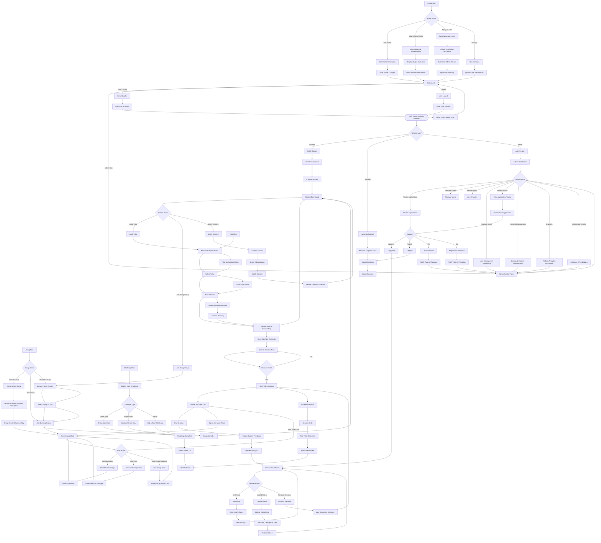
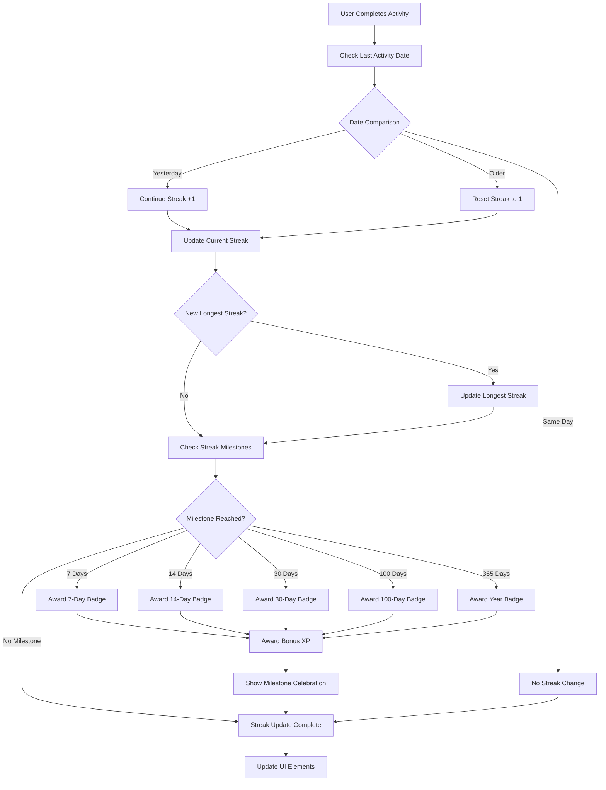
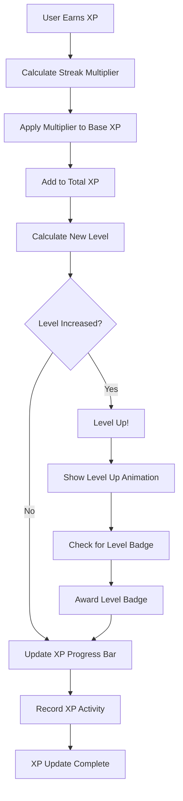
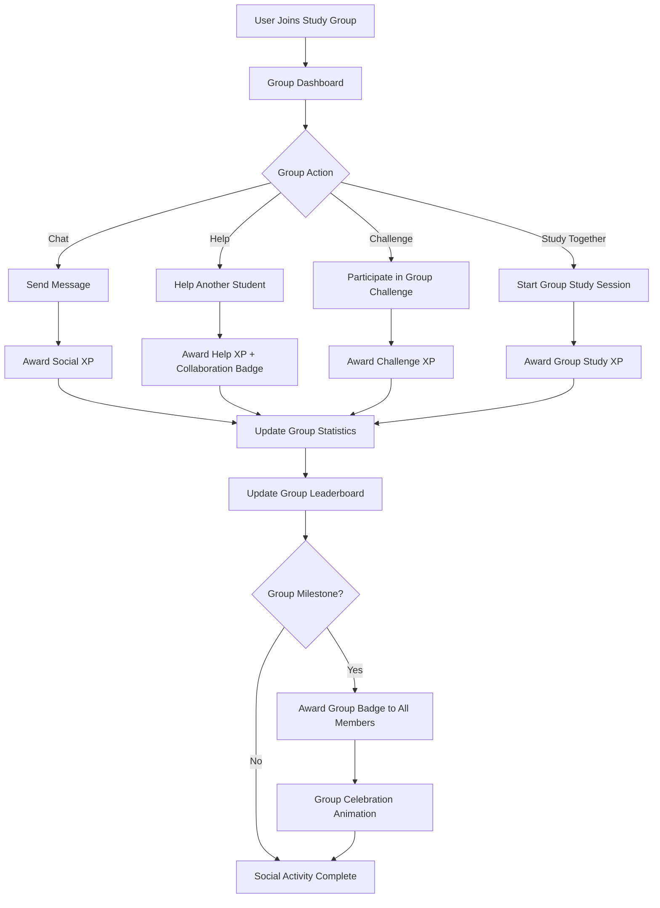

# Enhanced Learnity Activity Diagram

## Overview

This enhanced activity diagram shows the complete user journey through the gamified Learnity platform, including streak management, XP earning, and social learning features.

## Main User Flow Diagram

## Gamification Flow Details

### Streak Management Flow

### XP and Leveling Flow

### Social Learning Flow

## Key Gamification Elements

### 1. Streak Visualization
- **Fire emoji indicators** (like Snapchat)
- **Streak counter** with current and best streaks
- **Heat map calendar** (like GitHub contributions)
- **Streak freeze** options for premium users

### 2. XP and Leveling
- **Progress bars** with smooth animations
- **Level badges** with unique designs
- **XP multipliers** based on streaks
- **Bonus XP** for consistent activity

### 3. Achievement System
- **Milestone badges** for streaks (7, 14, 30, 100, 365 days)
- **Activity badges** for different types of learning
- **Social badges** for helping peers
- **Rare badges** for exceptional achievements

### 4. Social Features
- **Group leaderboards** for friendly competition
- **Peer help system** with XP rewards
- **Achievement sharing** on social feeds
- **Group challenges** and competitions

### 5. Daily Engagement
- **Daily challenges** with bonus XP
- **Login streaks** separate from learning streaks
- **Push notifications** for streak reminders
- **Personalized goals** based on user behavior

This enhanced activity diagram provides a comprehensive view of how users interact with the gamified Learnity platform, ensuring engagement through multiple touchpoints and reward mechanisms.