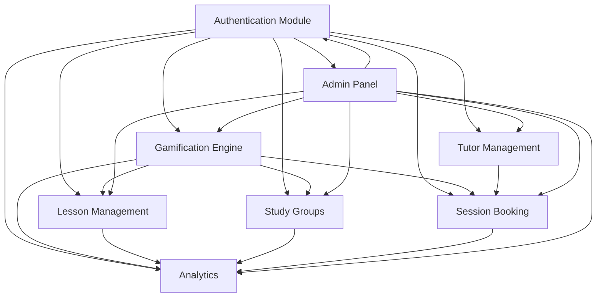
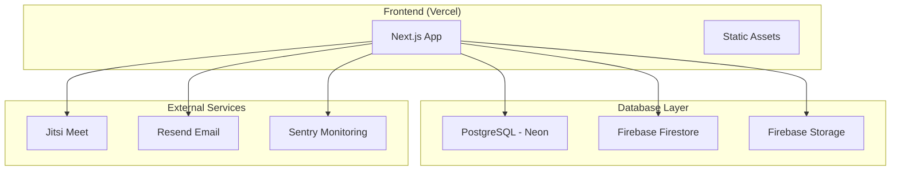

# Learnity Platform - Module Architecture

## Overview

Learnity is designed as a modular, gamified learning platform focused on simplicity and engagement. The platform is divided into core modules that work together to create an engaging educational experience.

## Core Modules

### 1. Authentication & User Management Module
**Purpose**: Handle user registration, login, and profile management
**Key Features**:
- Simple email/password authentication
- Role-based access (Student, Tutor, Admin)
- Profile management with gamification elements
- Social login (Google OAuth)

**Technologies**: NextAuth.js, Prisma, PostgreSQL

### 2. Gamification Engine Module
**Purpose**: Core gamification system inspired by Duolingo, Snapchat, and GitHub
**Key Features**:
- **Streak System**: Daily learning streaks with visual indicators
- **XP Points**: Experience points for various activities
- **Levels & Badges**: Progressive achievement system
- **Learning Paths**: Structured learning journeys
- **Daily Challenges**: Bite-sized daily tasks

**Technologies**: Custom React components, Zustand state management, PostgreSQL

### 3. Lesson Management Module
**Purpose**: Create, manage, and deliver interactive lessons
**Key Features**:
- Interactive lesson builder for tutors
- Multiple question types (MCQ, fill-in-blanks, drag-drop)
- Progress tracking and analytics
- Adaptive difficulty based on performance
- Micro-learning approach (5-15 minute lessons)

**Technologies**: Next.js, React Hook Form, Prisma

### 4. Study Groups & Community Module
**Purpose**: Foster collaborative learning through study groups
**Key Features**:
- Create and join study groups by subject
- Real-time chat with gamified elements
- Group challenges and competitions
- Peer-to-peer help system
- Community leaderboards

**Technologies**: Firebase Firestore, Socket.io, React

### 5. Tutor Verification & Management Module
**Purpose**: Simplified tutor onboarding and verification
**Key Features**:
- Manual verification process by admin
- Simple application form with document upload
- Tutor dashboard with analytics
- Rating and review system
- Availability management

**Technologies**: Next.js, Firebase Storage, Prisma

### 6. Session & Booking Module
**Purpose**: Streamlined 1-on-1 tutoring sessions
**Key Features**:
- Simple booking interface
- Integrated video calling (Jitsi Meet)
- Session recording and notes
- Automatic streak updates post-session
- Credit-based payment system

**Technologies**: Jitsi Meet API, Calendar integration, Prisma

### 7. Analytics & Progress Tracking Module
**Purpose**: Comprehensive learning analytics and progress visualization
**Key Features**:
- Personal learning dashboard
- Streak visualizations (heat maps like GitHub)
- Performance analytics
- Goal setting and tracking
- Parent/teacher progress reports

**Technologies**: Chart.js, D3.js, Custom analytics engine

### 8. Admin Control Panel Module
**Purpose**: Complete administrative control over the platform
**Key Features**:
- User management and moderation
- Content management system
- Tutor verification workflow
- Platform analytics and insights
- System configuration

**Technologies**: Next.js Admin UI, Prisma, Custom dashboard

## Module Interactions

## Technology Stack (Free Tools Only)

### Frontend
- **Framework**: Next.js 14 (App Router)
- **Styling**: Tailwind CSS + shadcn/ui
- **State Management**: Zustand
- **Forms**: React Hook Form + Zod
- **Charts**: Chart.js / Recharts
- **Icons**: Lucide React

### Backend
- **API**: Next.js API Routes
- **Database**: PostgreSQL (Neon DB - Free tier)
- **ORM**: Prisma
- **Authentication**: NextAuth.js
- **File Storage**: Firebase Storage (Free tier)
- **Real-time**: Firebase Firestore (Free tier)

### External Services
- **Video Calls**: Jitsi Meet (Free)
- **Email**: Resend (Free tier)
- **Monitoring**: Sentry (Free tier)
- **Deployment**: Vercel (Free tier)
- **CI/CD**: GitHub Actions (Free)

### Development Tools
- **Version Control**: Git + GitHub
- **Code Quality**: ESLint + Prettier
- **Testing**: Jest + React Testing Library
- **Type Safety**: TypeScript

## Deployment Architecture

## Module Development Priority

### Phase 1 (MVP - 4 weeks)
1. Authentication & User Management
2. Basic Gamification Engine (Streaks, XP)
3. Simple Lesson Management
4. Admin Control Panel

### Phase 2 (Enhanced Features - 3 weeks)
5. Study Groups & Community
6. Tutor Verification & Management
7. Session & Booking

### Phase 3 (Advanced Features - 3 weeks)
8. Analytics & Progress Tracking
9. Advanced Gamification Features
10. Mobile Optimization

## Scalability Considerations

- **Database**: Start with single PostgreSQL instance, can scale to read replicas
- **File Storage**: Firebase Storage with CDN for global distribution
- **Real-time**: Firebase Firestore handles scaling automatically
- **Caching**: Implement Redis for session caching in future
- **Load Balancing**: Vercel handles this automatically

## Security Measures

- **Authentication**: JWT tokens with secure httpOnly cookies
- **Authorization**: Role-based access control (RBAC)
- **Data Validation**: Zod schemas for all inputs
- **Rate Limiting**: Built-in Next.js rate limiting
- **CORS**: Properly configured for security
- **Environment Variables**: Secure secret management

This modular architecture ensures maintainability, scalability, and clear separation of concerns while keeping costs minimal through the use of free tools and services.