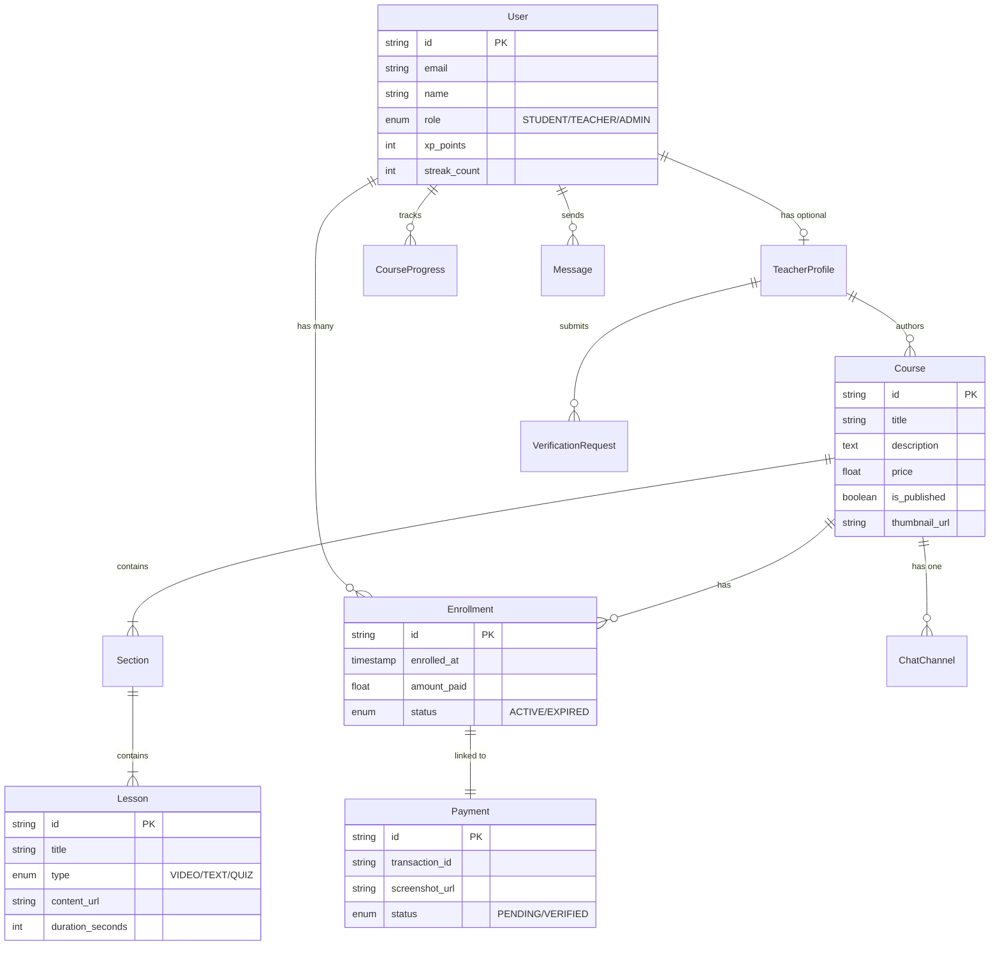
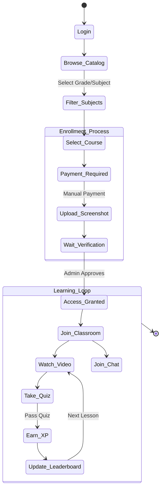
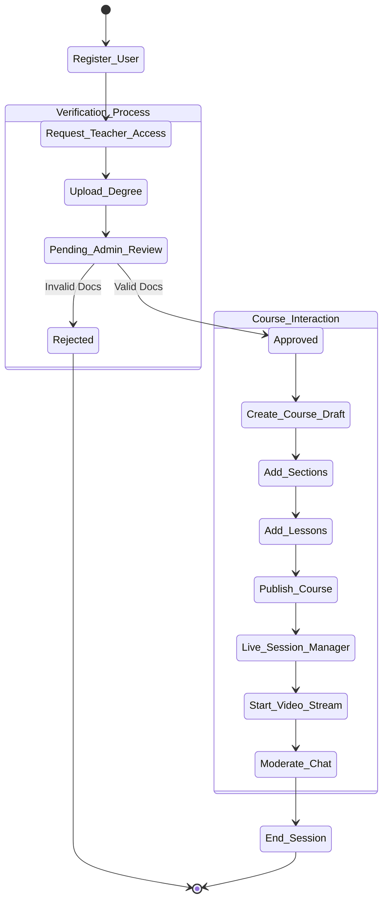
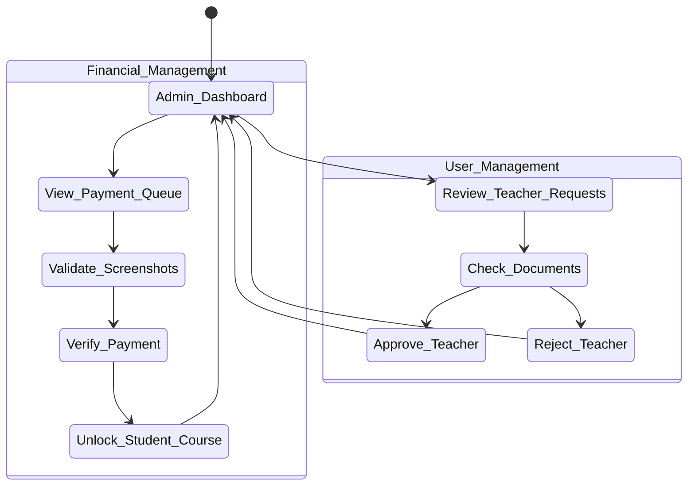

# LIST OF FIGURES (CHAPTER 3: DESIGN DIAGRAMS)

The following diagrams illustrate the design and architecture of the Learnity platform.

## Figure 3-1: Use Case Diagram

This diagram shows the interactions between the Student, Teacher, and Admin actors and the system's core functionalities.

```mermaid
usecaseDiagram
    actor Student
    actor Teacher
    actor Admin

    package "Learnity Eco-System" {
        usecase "Register/Login" as UC1
        usecase "Manage Profile" as UC_Profile

        package "Course Module" {
            usecase "Browse/Filter Courses" as UC_Browse
            usecase "Purchase Course" as UC_Buy
            usecase "Watch Lessons" as UC_Watch
            usecase "Take Quiz" as UC_Quiz
        }

        package "Teaching Module" {
            usecase "Create Course Content" as UC_Create
            usecase "Start Live Class" as UC_Live
            usecase "Review Assignments" as UC_Review
            usecase "Request Verification" as UC_Verify
        }

        package "Admin Module" {
            usecase "Approve Teacher" as UC_Approve
            usecase "Verify Payments" as UC_PayVerify
            usecase "System Analytics" as UC_Analytics
        }

        usecase "Chat in Classroom" as UC_Chat
    }

    Student --> UC_Browse
    Student --> UC_Buy
    Student --> UC_Watch
    Student --> UC_Quiz
    Student --> UC_Chat

    Teacher --> UC_Create
    Teacher --> UC_Live
    Teacher --> UC_Review
    Teacher --> UC_Verify
    Teacher --> UC_Chat

    Admin --> UC_Approve
    Admin --> UC_PayVerify
    Admin --> UC_Analytics

    %% Relationships
    UC_Buy ..> UC1 : <<include>>
    UC_Create ..> UC_Verify : <<requires>>
```

## Figure 3-2: Entity Relationship Diagram (ERD)

This diagram details the normalized database schema, showing relationships between Users, Courses, Sections, Lessons, Enrollments, and Payments.



## Figure 3-3: Activity Diagram (Student Workflow)

This flowchart demonstrates the student's journey from course discovery to enrollment, payment, and learning.



## Figure 3-4: Activity Diagram (Teacher Workflow)

This diagrams the process of teacher verification, course creation, and conducting live sessions.



## Figure 3-5: Activity Diagram (Admin Workflow)

This diagram illustrates the administrative processes for verifying teachers and payments.



## Figure 3-6: System Architecture Diagram

This diagram breaks down the "Modular Monolith" architecture, showing the Client, Server (Next.js), Database (Postgres), and real-time services.

```mermaid
graph TD
    subgraph Client_Side ["Client Layer (Browser/PWA)"]
        UI[React UI Components]
        State[Zustand Store]
        Local[Local Storage (Tokens)]
    end

    subgraph Server_Side ["Server Layer (Next.js 14)"]
        API[Server Actions / API Routes]
        Auth[NextAuth.js Middleware]
        Upload[Vercel Blob Storage]
    end

    subgraph Data_Layer ["Data Persistence"]
        Prisma[Prisma ORM engine]
        Postgres[(Neon DB Cluster)]
    end

    subgraph RealTime ["Real-Time Infrastructure"]
        Stream[GetStream.io (Chat)]
        HMS[100ms.live (Video)]
    end

    UI -->|JSON/RPC| API
    UI -->|WebSocket| Stream
    UI -->|UDP/WebRTC| HMS

    API -->|Authenticate| Auth
    API -->|Validation| Prisma
    API -->|Store Images| Upload

    Prisma -->|Query/Transaction| Postgres
```
